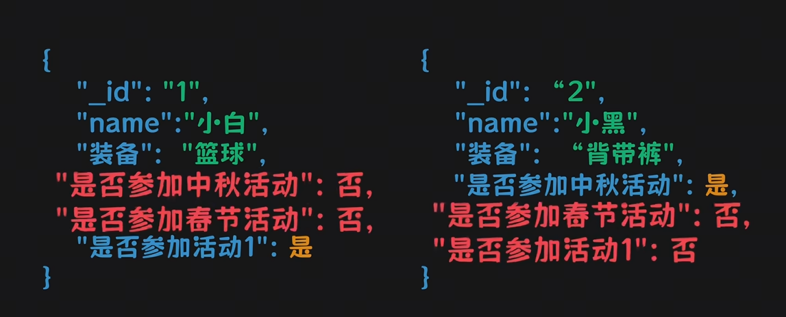

简单说，MongoDB就是一个比较灵活一点的MySQL。


抛弃了列的概念，将每一个数据以一个类似于 json 字段的形式存储：



因此，每条数据都叫做一个**文档**，一个文档中包含了一个`_id`字段，就是主键ID，用于这个文档的定位。文档和文档之间不需要完全一致。


同时，多个文档组合到一起就构成了**集合**。类似于MySQL的表结构。


## 语法

```SQL
db.user.find({_id:"132"})  # 查询语句

db.user.updateOne(
{_id:"123"},
{$set:{name:"abcd"}}
)  # 更新字段值的语句


```


## 实现


MongoDB使用的是BSON（Binary JSON）编码，实际上是在JSON的基础做了一层拓展，使得JSON支持二进制等数据类型的存储。


mongoDB会将以BSON文档组成的集合以.wt为后缀的文件存放到磁盘中。同时会将一个.wt文件拆分成大小为**32KB**的页。此时如果需要读取某些BSON文档，就只需要读取部分数据页即可，不需要读取整个文件，优化了读取的速率。（这是一种拆分的思想）

